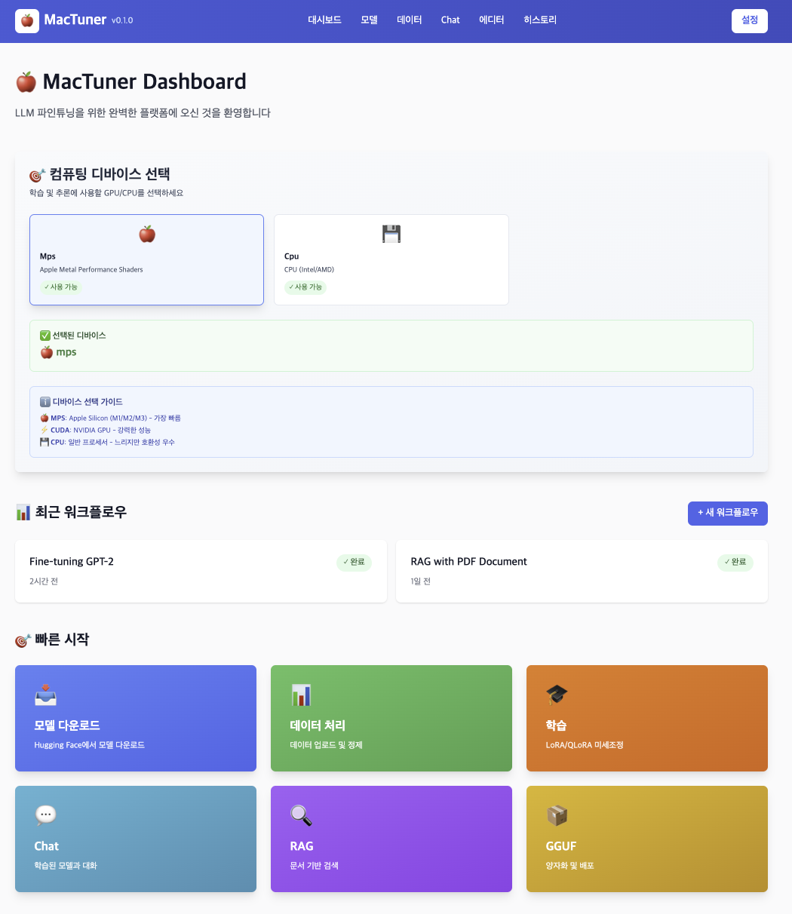
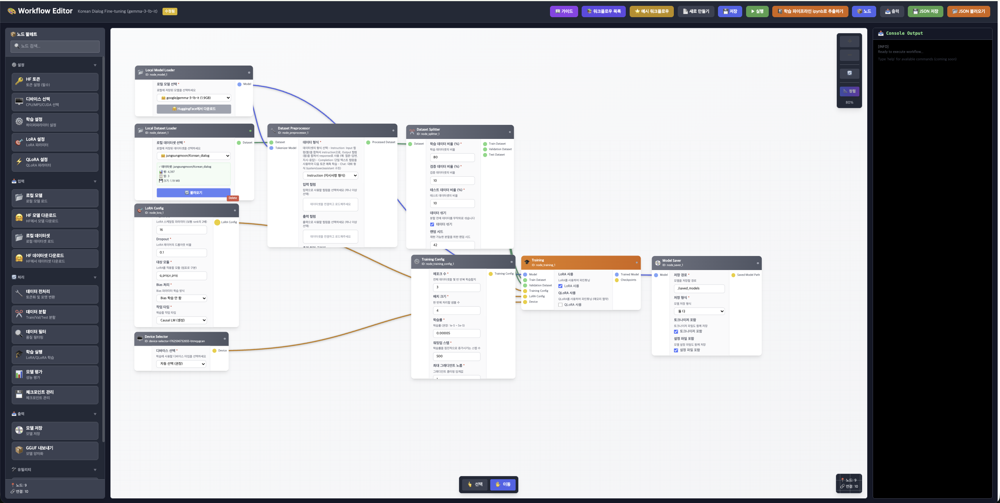

# 🍎 MACtuner

**Mac 환경 최적화 LLM 파인튜닝 & 배포 플랫폼**

[](https://www.python.org/downloads/)
[](LICENSE)
[](https://pypi.org/)
[](#)

---

## 📋 목차

- [소개](#-소개)
- [주요 기능](#-주요-기능)
- [스크린샷](#-스크린샷)
- [설치 방법](#-설치-방법)
- [빠른 시작](#-빠른-시작)
- [프로젝트 구조](#-프로젝트-구조)
- [API 문서](#-api-문서)
- [기여 방법](#-기여-방법)
- [라이선스](#-라이선스)

---

## 🎯 소개

**MACtuner**는 Apple Silicon(M1/M2/M3) Mac에서 대규모 언어 모델(LLM)을 효율적으로 파인튜닝하고 배포할 수 있도록 설계된 올인원 플랫폼입니다.

Mac의 제한된 리소스를 최대한 활용하기 위해 다음과 같은 최적화 기술을 활용합니다:

- **LoRA (Low-Rank Adaptation)**: 파라미터 효율적 파인튜닝
- **GGUF 양자화**: 모델 크기 최소화 및 추론 속도 향상
- **RAG (Retrieval Augmented Generation)**: 맞춤형 데이터를 활용한 답변 생성
- **MPS (Metal Performance Shaders)**: Apple Silicon GPU 활용

### 🎨 핵심 지원 기능

- 🤖 **LLM 파인튜닝**: LoRA, QLoRA를 통한 효율적 학습
- 🎛️ **모델 양자화**: GGUF 형식으로 모델 변환 및 최적화
- 📚 **데이터 관리**: CSV, Parquet, HuggingFace 데이터셋 지원
- 💬 **RAG 파이프라인**: PDF 문서 기반 답변 생성
- 🌐 **웹 UI**: 직관적인 대시보드 및 워크플로우 에디터
- 📊 **모니터링**: 실시간 학습 진행 상황 추적

---

## 🌟 주요 기능

### 1️⃣ **대시보드** (Dashboard)

- 하드웨어 정보 표시 (MPS, CPU, CUDA)
- 설치된 데이터셋 현황
- 최근 워크플로우 목록
- 빠른 접근 패널

### 2️⃣ **모델 다운로드** (Model Download)

- HuggingFace에서 모델 자동 다운로드
- GPU/CPU 선택 가능
- 다운로드 진행 상황 실시간 추적

### 3️⃣ **데이터 처리** (Data Processing)

- CSV 파일 업로드 및 EDA
- HuggingFace 데이터셋 통합
- 데이터 전처리 및 검증
- 그리드 뷰 데이터 탐색

### 4️⃣ **LoRA 학습** (Training)

- LoRA/QLoRA 파인튜닝
- 학습률, 배치 크기 등 하이퍼파라미터 조정
- 체크포인트 저장 및 복구
- 실시간 손실값 모니터링

### 5️⃣ **GGUF 내보내기** (Export GGUF)

- 학습된 모델을 GGUF 형식으로 변환
- 양자화 레벨 선택 (Q4, Q5, Q8)
- 메타데이터 포함

### 6️⃣ **RAG 파이프라인** (RAG)

- PDF 문서 임베딩
- 의미론적 검색
- 맥락 기반 답변 생성

### 7️⃣ **Chat Interface** (Chat)

- 로컬 모델과의 대화
- 여러 모델 선택 가능
- 대화 히스토리 관리

### 8️⃣ **Workflow Editor** (워크플로우 에디터)

- 노드 기반 파이프라인 구성
- 드래그 앤 드롭 인터페이스
- 복잡한 워크플로우 자동화

---

## 📸 스크린샷

### Dashboard


_MACtuner 메인 대시보드 - 하드웨어 정보, 데이터셋, 워크플로우 관리_

### Chat Interface


_LLM 채팅 인터페이스 - 다양한 모델 선택 및 실시간 대화_

### Workflow Editor


_고급 워크플로우 에디터 - 노드 기반 파이프라인 구성 및 실행_

---

## 🚀 설치 방법

### 필수 요구사항

- **OS**: macOS 11 이상 (Apple Silicon 또는 Intel)
- **Python**: 3.11 이상
- **RAM**: 최소 8GB (16GB 권장)
- **디스크 공간**: 20GB 이상 (모델 저장용)

### 1. 저장소 클론

```bash
git clone https://github.com/Hyun00505/Mactuner.git
cd Mactuner
```

### 2. 백엔드 환경 설정

#### 옵션 A: UV 사용 (권장)

```bash
# uv 설치 (처음 한 번만)
curl -LsSf https://astral.sh/uv/install.sh | sh

# 종속성 설치
uv sync
```

#### 옵션 B: pip 사용

```bash
# 가상 환경 생성
python3.11 -m venv venv
source venv/bin/activate

# 종속성 설치
pip install -r backend/requirements.txt
```

### 3. 프론트엔드 환경 설정

```bash
cd frontend

# Node.js 종속성 설치
npm install

# 또는 yarn 사용
yarn install
```

### 4. 환경 변수 설정

```bash
# 프로젝트 루트에서
cp .env.example .env

# .env 파일 수정 (필요시)
nano .env
```

필요한 환경 변수:

```env
# HuggingFace
HF_TOKEN=your_huggingface_token_here

# 모델 경로
MODEL_DIR=./models
OUTPUT_DIR=./output

# 포트
BACKEND_PORT=8000
FRONTEND_PORT=5173
```

---

## 🎮 빠른 시작

### 옵션 1: 전체 통합 실행 (권장) 🌟

한 번의 명령으로 백엔드 + 프론트엔드를 모두 실행합니다:

```bash
# 모든 필수 패키지 설치 (처음 한 번만)
cd frontend && npm install && cd ..
pip install -r backend/requirements.txt

# 통합 실행
python app.py
```

이 명령으로 다음이 자동으로 시작됩니다:
- 🌐 프론트엔드 웹 UI: http://localhost:3000
- 🔌 백엔드 API: http://localhost:8001
- 📚 Swagger API 문서: http://localhost:8001/docs

---

### 옵션 2: 백엔드만 실행

```bash
# FastAPI 백엔드만 실행
python -m uvicorn backend.main:app --reload --port 8001
```

- 🔌 API: http://localhost:8001
- 📚 API 문서: http://localhost:8001/docs
- ✅ Postman, curl 등으로 API 테스트 가능

---

### 옵션 3: 프론트엔드 개발 서버

```bash
cd frontend

# 개발 서버 시작 (포트 5173)
npm run dev

# 또는 Electron 데스크톱 앱으로 실행 (Mac 네이티브)
npm run dev:electron

# 또는 프로덕션 빌드
npm run build
npm run preview
```

---

### 옵션 4: Python CLI만 사용

npm/프론트엔드 없이 Python CLI로만 사용:

```bash
# 모델 학습
python trainer.py

# CLI 채팅 인터페이스
python chat_interface.py

# RAG 파이프라인
python rag_pipeline.py

# 데이터 분석
python data_eda.py
```

---

## 📂 프로젝트 구조

```
Mactuner/
├── backend/                          # 백엔드 서버
│   ├── api/                         # API 엔드포인트
│   │   ├── chat_interface.py       # 채팅 API
│   │   ├── dataset_tools.py        # 데이터셋 처리
│   │   ├── export_gguf.py          # GGUF 내보내기
│   │   ├── model_loader.py         # 모델 로딩
│   │   ├── rag_pipeline.py         # RAG 파이프라인
│   │   └── training.py             # 학습 API
│   ├── services/                    # 비즈니스 로직
│   │   ├── chat_service.py         # 채팅 서비스
│   │   ├── dataset_service.py      # 데이터셋 서비스
│   │   ├── llama_cpp_service.py    # Llama.cpp 통합
│   │   ├── model_service.py        # 모델 관리
│   │   ├── quantization_service.py # 양자화 서비스
│   │   ├── rag_service.py          # RAG 서비스
│   │   └── training_service.py     # 학습 서비스
│   ├── utils/                       # 유틸리티
│   │   └── mac_optimization.py     # Mac 최적화
│   ├── main.py                      # FastAPI 애플리케이션
│   ├── config.py                    # 설정
│   └── requirements.txt             # Python 종속성
│
├── frontend/                        # 프론트엔드 UI
│   ├── src/
│   │   ├── components/             # React 컴포넌트
│   │   │   ├── Editor/            # 워크플로우 에디터
│   │   │   ├── DataGrid.tsx        # 데이터 그리드
│   │   │   ├── Header.tsx          # 헤더
│   │   │   └── ...
│   │   ├── pages/                 # 페이지
│   │   │   ├── Dashboard.tsx       # 대시보드
│   │   │   ├── Chat.tsx            # 채팅
│   │   │   ├── DataProcessing.tsx  # 데이터 처리
│   │   │   └── ModelDownload.tsx   # 모델 다운로드
│   │   ├── stores/                # Zustand 스토어
│   │   ├── utils/                 # 유틸리티
│   │   ├── types/                 # TypeScript 타입
│   │   └── App.tsx                # 메인 앱
│   ├── electron/                  # Electron 설정
│   │   ├── main.js               # Electron 메인 프로세스
│   │   └── preload.js            # 프리로드 스크립트
│   ├── package.json              # 종속성
│   └── tsconfig.json             # TypeScript 설정
│
├── data/                           # 데이터 디렉토리
│   └── dataset_history.json       # 데이터셋 메타데이터
│
├── tests/                         # 테스트
│   └── backend/
│       ├── test_chat.py
│       ├── test_dataset_tools.py
│       ├── test_export_gguf.py
│       ├── test_model_loader.py
│       ├── test_rag.py
│       └── test_training.py
│
├── pyproject.toml                # 프로젝트 설정
├── README.md                     # 이 파일
└── LICENSE                       # MIT 라이선스
```

---

## 🔌 API 문서

### 주요 엔드포인트

#### 모델 관리

```bash
# 모델 다운로드
POST /api/model/download
Content-Type: application/json

{
  "model_id": "meta-llama/Llama-2-7b",
  "device": "mps"  # mps, cpu, cuda
}
```

#### 데이터셋 처리

```bash
# 데이터셋 업로드
POST /api/dataset/upload
Content-Type: multipart/form-data

file: <CSV 또는 Parquet 파일>

# 데이터셋 조회
GET /api/dataset/list

# HuggingFace 데이터셋 다운로드
POST /api/dataset/download-hf
Content-Type: application/json

{
  "dataset_id": "kuotient/orca-math-korean-dpo-pairs",
  "split": "train"
}
```

#### 학습

```bash
# 학습 시작
POST /api/training/start
Content-Type: application/json

{
  "model_name": "meta-llama/Llama-2-7b",
  "dataset_id": 1,
  "learning_rate": 2e-4,
  "num_epochs": 3,
  "batch_size": 4
}

# 학습 상태 조회
GET /api/training/status
```

#### GGUF 내보내기

```bash
# GGUF 내보내기
POST /api/export/gguf
Content-Type: application/json

{
  "checkpoint_path": "./models/lora_model",
  "quantization_level": "q4_0"
}
```

#### 채팅

```bash
# 메시지 전송
POST /api/chat/message
Content-Type: application/json

{
  "model_name": "meta-llama/Llama-2-7b",
  "message": "안녕하세요",
  "max_tokens": 512
}
```

#### RAG

```bash
# PDF 업로드 및 임베딩
POST /api/rag/upload-pdf
Content-Type: multipart/form-data

file: <PDF 파일>

# RAG 쿼리
POST /api/rag/query
Content-Type: application/json

{
  "query": "질문 내용",
  "model_name": "meta-llama/Llama-2-7b",
  "top_k": 3
}
```

자세한 API 문서는 `http://localhost:8000/docs` (Swagger UI)를 참조하세요.

---

## 💻 개발 환경 설정

### 코드 포맷팅 및 린팅

```bash
# Black으로 포맷팅
uv run black backend/

# Ruff로 린팅
uv run ruff check backend/ --fix

# MyPy 타입 체크
uv run mypy backend/
```

### 테스트 실행

```bash
# 모든 테스트 실행
uv run pytest

# 특정 테스트 실행
uv run pytest tests/backend/test_chat.py

# 커버리지 리포트
uv run pytest --cov=backend --cov-report=html
```

---

## 🐛 문제 해결

### 문제: `ImportError: No module named 'llama_cpp'`

**해결책**: llama-cpp-python은 시스템 환경에 따라 설치가 복잡할 수 있습니다.

```bash
# 사전 컴파일된 바이너리 사용
pip install llama-cpp-python --only-binary :all:

# 또는 Conda 사용
conda install -c conda-forge llama-cpp-python
```

### 문제: Mac에서 PyTorch 느린 성능

**해결책**: MPS 가속화 활성화 확인

```python
import torch
print(torch.backends.mps.is_available())  # True여야 함
```

### 문제: 메모리 부족 (Out of Memory)

**해결책**: 배치 크기 감소 또는 QLoRA 사용

```python
# 학습 설정
batch_size = 2  # 4에서 감소
use_qlora = True  # 4-bit 양자화 활성화
```

---

## 🤝 기여 방법

저희는 모든 기여를 환영합니다!

### 기여 절차

1. **저장소 포크**

   ```bash
   git clone https://github.com/YOUR_USERNAME/Mactuner.git
   ```

2. **기능 브랜치 생성**

   ```bash
   git checkout -b feature/amazing-feature
   ```

3. **코드 수정**

   - 코드 스타일 준수 (Black, Ruff)
   - 타입 힌트 추가
   - 문서화

4. **테스트 작성 및 실행**

   ```bash
   uv run pytest
   ```

5. **커밋 및 푸시**

   ```bash
   git add .
   git commit -m "feat: 멋진 기능 추가"
   git push origin feature/amazing-feature
   ```

6. **Pull Request 생성**

### 개발 가이드라인

- Python 3.11+ 호환성 유지
- PEP 8 스타일 가이드 준수
- 모든 공개 함수에 docstring 추가
- 50줄 이상의 코드는 테스트 작성

---

## 📝 CHANGELOG

### v0.1.0 (2025-11-09)

- ✨ 초기 릴리스
- 🎯 Dashboard 페이지 구현
- 🔄 Model Loader 통합
- 📚 Dataset Processing 기능
- 🚀 LoRA 파인튜닝 파이프라인
- 💬 Chat Interface 구현
- 📊 Workflow Editor 추가
- 🔌 RAG 파이프라인 지원

---

## 📚 참고 자료

- [PyTorch 공식 문서](https://pytorch.org/)
- [Transformers 라이브러리](https://huggingface.co/transformers/)
- [PEFT (Parameter-Efficient Fine-Tuning)](https://github.com/huggingface/peft)
- [GGUF 형식](https://github.com/ggerganov/ggml/blob/master/docs/gguf.md)
- [LLaMA 모델](https://github.com/meta-llama/llama)

---

## ✋ 지원

문제가 있거나 질문이 있으신가요?

- 📧 이메일: bunhine0452@gmail.com
- 🐛 [GitHub Issues](https://github.com/Hyun00505/Mactuner/issues)에서 버그 리포트
- 💬 [Discussions](https://github.com/Hyun00505/Mactuner/discussions)에서 토론

---

## 📄 라이선스

이 프로젝트는 **MIT 라이선스**를 따릅니다. 자세한 내용은 [LICENSE](LICENSE) 파일을 참조하세요.

---

## 🙏 감사의 말

이 프로젝트는 다음 오픈소스 프로젝트를 기반으로 합니다:

- [FastAPI](https://fastapi.tiangolo.com/)
- [PyTorch](https://pytorch.org/)
- [Hugging Face Transformers](https://huggingface.co/transformers/)
- [React](https://react.dev/)
- [Electron](https://www.electronjs.org/)

---

<div align="center">

**MACtuner로 Mac에서 LLM을 다루는 것을 쉽게 만들어보세요! 🚀**

[⭐ Star 주기](https://github.com/Hyun00505/Mactuner) | [🐛 이슈 제보](https://github.com/Hyun00505/Mactuner/issues) | [💬 토론](https://github.com/Hyun00505/Mactuner/discussions)

</div>
